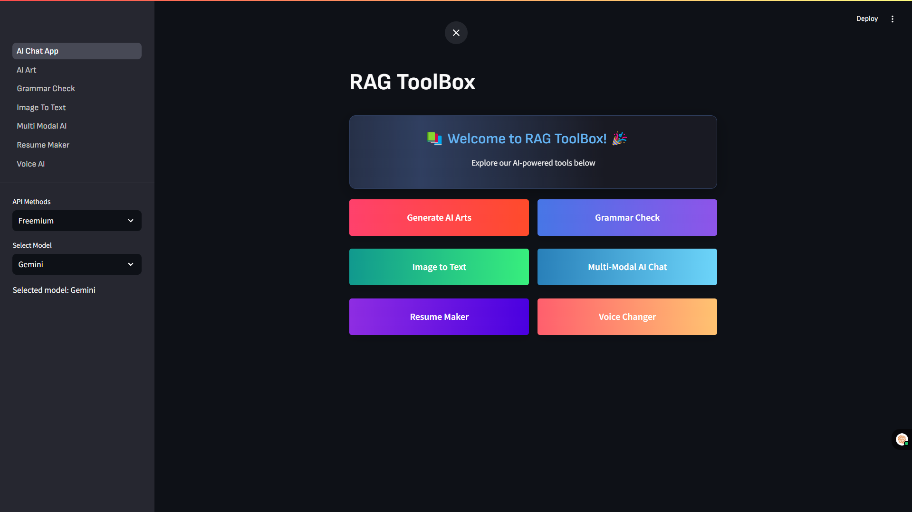

# RAG ToolBox - AI-Powered Toolkit



## Overview

RAG ToolBox is a comprehensive suite of AI-powered tools designed to enhance productivity and creativity. Built with Streamlit, this application provides a user-friendly interface to access various AI capabilities.

## Features

- **Generate AI Arts**: Create stunning AI-generated artwork with customizable parameters
- **Grammar Check**: Improve your writing with AI-powered grammar and style suggestions
- **Image to Text**: Extract text content from images using advanced OCR technology
- **Multi-Modal AI Chat**: Interact with a sophisticated AI that understands both text and images
- **Resume Maker**: Build professional resumes with AI assistance
- **Voice Changer**: Transform your voice with various audio effects

## Getting Started

### Prerequisites

- Python 3.8 or higher
- Streamlit
- Required Python packages (see requirements.txt)

### Installation

1. Clone the repository:
```bash
git clone https://github.com/yourusername/rag-toolbox.git
cd rag-toolbox
```

2. Install dependencies:
```bash
pip install -r requirements.txt
```

3. Run the application:
```bash
streamlit run "AI Chat App.py"
```

## Usage

1. Select a tool from the main dashboard
2. Choose between Freemium API access or enter your own API key
3. Follow the tool-specific instructions to achieve your desired results

## API Options

The application supports multiple AI models:
- Gemini
- Mistral
- DeepSeek

## Contributing

Contributions are welcome! Please feel free to submit a Pull Request.

## License

This project is licensed under the MIT License - see the LICENSE file for details.